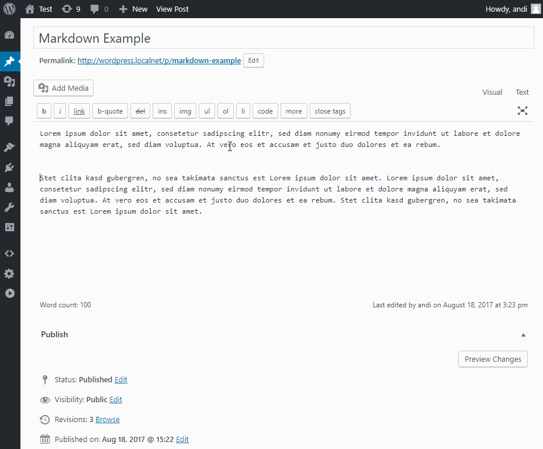
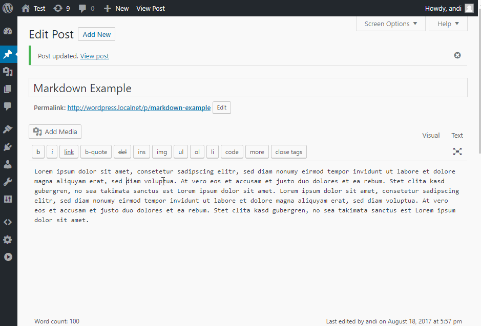

Enlighter Markdown Tutorial
=====================================

Enlighter comes with extended **github flavored markdown** support which allows you to used fenced codeblocks as well as backtick inline code within text-editor.

This is an optional feature which has to be enabled on the Enlighter Settings Page: `Enlighter -> Editing -> Markdown`

Fenced Codeblocks
-------------------------------------

Fenced Codeblocks are separated by **three backticks**. You can set the codeblock language optionally by adding the identifier to the end of the start delimiter.

### Example ###



### Structure ###

**Syntax**

    ```<language>
    ...code...
    ```

**Example**

    ```php
    // generate code fragment
    $T->_codeFragments[] = array(
        // the language identifier
        'lang' => $lang,

        // code to highlight
        'code' => $match[1],

        // inline
        'inline' => true
    );
    ```

Extended Inline Code
-------------------------------------

Enlighter supports extended inline markdown code using backticks with a **trailing language identifier** to set the language of the snippet

### Example ###



### Structure ###

**Syntax:** `` `code`<language> ``

**Example:** `` `console.info('Hello World');`js ``


Standard Inline Code
-------------------------------------

Standard inline code does not allow you to set the language. In this case the default mode will be used - you can change it in `Enlighter -> Editing -> Markdown`

### Structure ###

**Syntax:** `` `code` ``

**Example:** `` `console.info('Hello World');` ``

