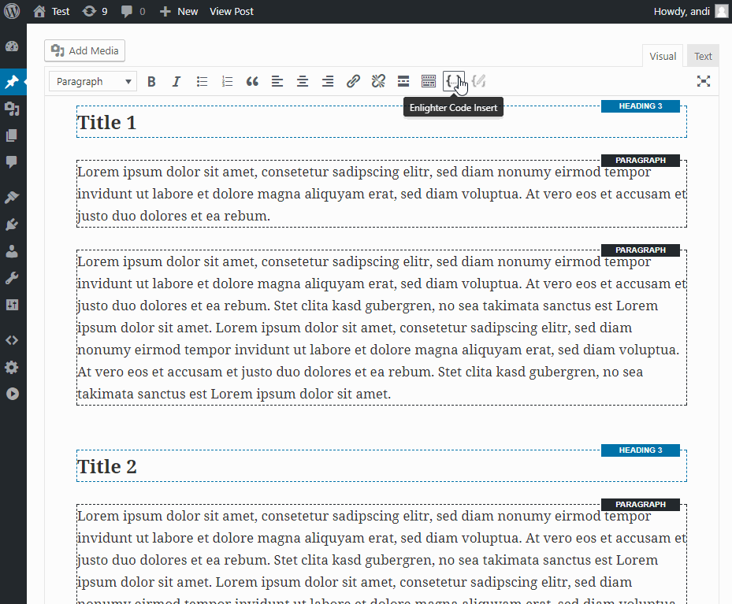
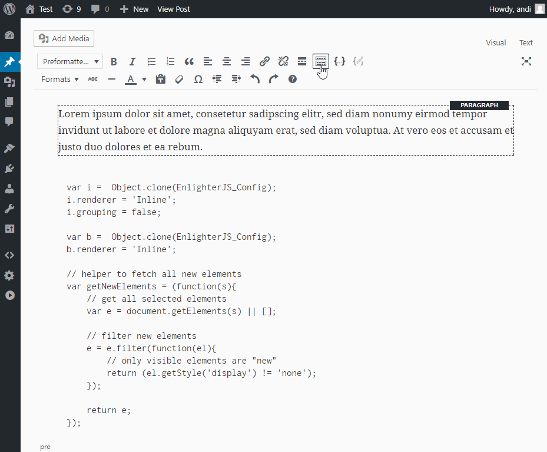
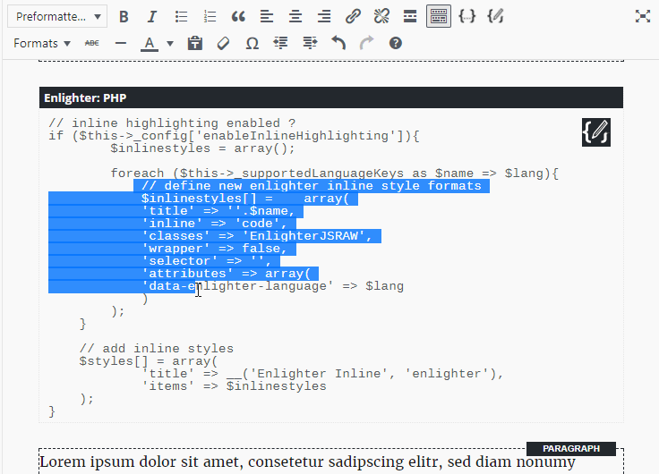
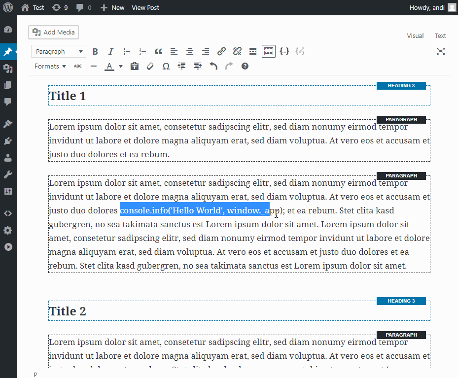
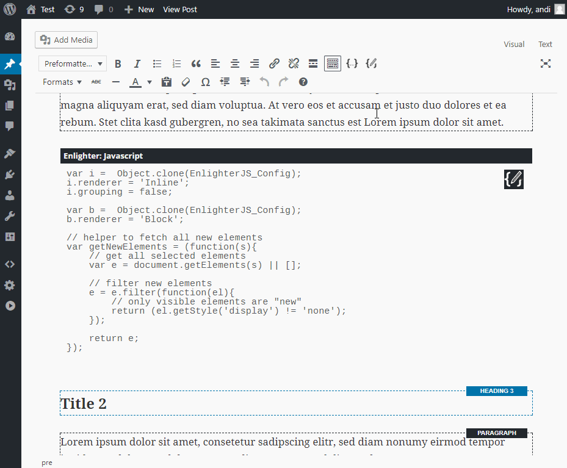
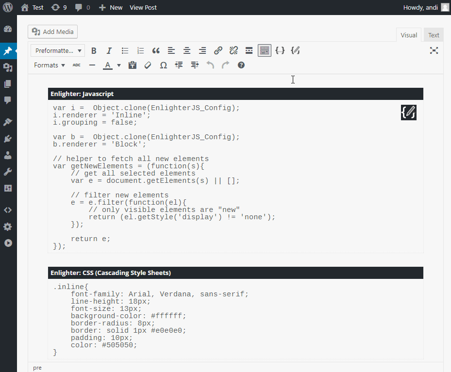

Enlighter Visual Editor Tutorial
=====================================

> The important things first: please use the **Visual Editor Plugin** whenever possible - its **not recommended to use shortcodes** in the Visual Editor!
> 
> Shortcodes are designed to be used with the **Text Editor (HTML)** only!

Insert Code-Snippets
-----------------------------------------

Enlighter provides a full Visual-Editor-Integration (TinyMCE) which allows you to edit add/edit code to your posts seemless.

### Example ###

### Steps ###

1. Move the Cursor to the position you want to insert the code snippet
2. Click on the `Enlighter Code Insert` Button on the upper right of the toolbar
3. Paste your snippet into the text-area
4. Select the language of your snippet (javascript in this example)
5. Select "Left-Align-Indentation" - this will strip the unnecessary code indentation (marked in the example)
6. Click **OK**
7. You can edit the snippet directly in the Visual Editor at any time
8. Publish your post!

Use Editor-Formats to highlight existing code
------------------------------------------------------

Sometime you already have some code within your posts you want to highlight. In this case Enlighter comes with its own **Formats** which allows you to highlight a selected text in the Visual Editor.

### Example ###

### Steps ###

1. Expand the Editor Toolbar
2. Select the content you want to highlight
3. Goto `Formats -> Enlighter Codeblocks` and select the language
4. Publish your post!

Align your code with <kbd>tab</kbd> key
------------------------------------------------------

Enlighter 3.5 comes with its own tab-alignment addon which allows you to align your code directly within the editor (optional feature).

**Requirement**: Set `Enlighter -> Editing -> Visual Editor -> Tweaks -> Enable Tab Indentation`

* Move Right: Select code + press <kbd>tab</kbd> key
* Move Left: Select code + press <kbd>shift</kbd>+<kbd>tab</kbd> key

Use Inline Code Highlighting
------------------------------------------------------

Enlighter allows you to highlight codeblocks as well as **inline snippets** out-of-the-box. Inline-Code is often used to highlight small pieces of code diretly within a larger textblock.

### Example ###

### Steps ###

1. Expand the Editor Toolbar
2. Select the content you want to highlight
3. Goto `Formats -> Enlighter Inline` and select the language
4. Publish your post!

Change Code Settings / Advanced Code Settings
------------------------------------------------------

Sometime you may need some advanced features like

* Disable Linenumbers
* Change Theme of a individual codeblock
* Set a linenumber offset
* Highlight special lins
* Create Codegroups

this settings are available after the code-snippet has been added to the editor by using the `Enlighter Code Settings` Button

### Example ###

### Steps ###

1. Move the Cursor into an existing Enlighter Codeblock (or inline)
2. The `Enlighter Code Settings` Button will appear on the upper right side of the codeblock **and** on the upper right of the toolbar
3. Click on the `Enlighter Code Settings` Button
4. An advanced settings dialog will be opened
5. Change the Theme
6. Set a linenumber-offset
7. Highlight a special line
8. Click **OK**
9. Publish your post!

Codegroups
------------------------------------------------------

In some cases, your code example rely on a several different languages. For example **HTML**, **CSS** and **Javascript**. It can be helpful to group this snippets together.

### Example ###

### Steps ###

1. Add some code snippets to your post
2. Click on the `Enlighter Code Settings` Button to edit a codeblock
3. Add a `Codegroup Identifier` to each codeblock you want to group together (has to be **unique** for each group)
4. Add an optional `Codegroup Title` to each codeblock - its used as the tabname
